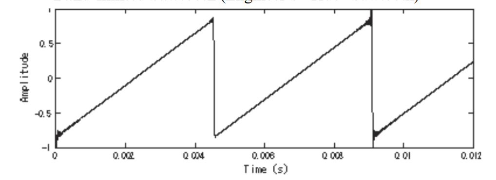
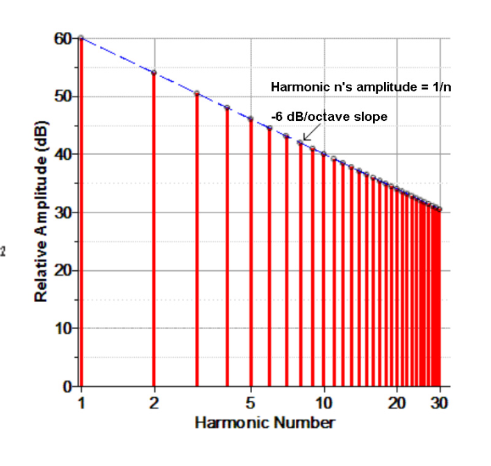

# Band Limited Sawtooth

A **band-limited sawtooth** is a [[sawtooth-wave|sawtooth wave]] that has been [[bandlimiting|band-limited]], i.e. it has no [[frequency]] content above a certain threshold (in this case, $SR/2$).

- called "Engineer's Sawtooth" by Haken; a perfect, [[digital-audio|digital audio]] sawtooth
  - contrast to the "Noob's sawtooth", which is just the naïve implementation of a sawtooth that causes [[aliasing]] due to no bandlimiting
- perfect "saw" [[spectrum]] up to frequency $SR/2$ with each [[partial]] $n$ having an [[amplitude]] $A_n = \frac{1}{n}$ (where $SR$ is the sample rate)
  - results in a spectrum with -6 dB/octave slope
- No energy above $SR/2$ means no aliasing at all

## Digital Nuances

Because [[sampling-signal-processing|digital sampling]] has a finite number of samples to represent the sawtooth, each period within the waveform looks a little different; each period has a different peak and amplitude

- in analog, a sawtooth (or any [[waveform]]) could be represented perfectly, with no "wiggles"

## Sources

- ECE 402 Lecture 17
