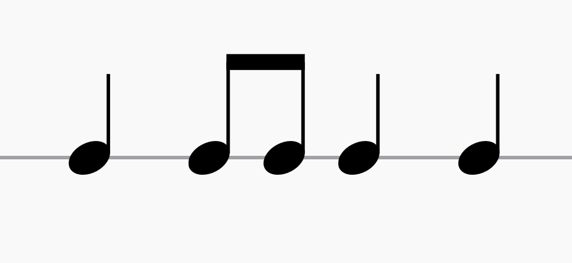

---
tags:
---

# Binalig

**_Binalig_** is a term meaning "made different" in the [[maguindanao|Maguindanaon]] language.

For Maguindanaon musicians and scholars, the word _binalig_ has multiple interpretations:

- the embodiment of change in [[kulintang]] music
- a generative concept that is key to understanding creativity, innovation, and transformation in [[maguindanao|Maguindanaon]] [[palabunibunyan]] music tradition
- "made different", specifically regarding kulintang playing style
- describes pieces that communicate, or allow for, self expression
- describes a distinct [[kulintang-rhythmic-modes|rhythmic mode/genre/type]] of kulintang pieces

The root word _balig_ has related meanings:

- "the stage of life from early to late adolescence"
- "slang"
- "with a foreign accent"

## Rhythmic Mode

Binalig is a common rhythmic mode in [[kulintang]] music. The following sections explain different interpretations of _binalig_ by different scholars/musicians.

### Harold Andre

In a [[palabunibunyan|kulintang ensemble]], each player follows this basic pattern and improvises rhythms and phrases over it.

### Kristina Benitez

Binalig pieces consist of two-beat musical phrases with emphasis at the beginning of each beat.

This base structure is identical to [[duyug-sirong|duyug/sirong]] pieces. However, binalig is distinguished by the following characteristics:

- the consistent use of paired musical phrases in the kulintang
  - this pairing reflects how [[maguindanao|Maguindanaon]] songs often have melodies with complementary phrases
- the greater density in the musical phrases that often feature repeated strokes on one or two gongs, particularly at the end of the phrase
- common for binalig pieces (and not other genres) that the opening section features an ascent to gong 7 following the usual initial strokes on gong 3
- the "rendering" of lines and phrases of popular songs on kulintang
- an extended closing section 5-10 phrases long, which including musical phrases different from those in the main body of the piece
- last stroke is on beat 1, usually ending on gong 2
  - occasional endings on gong 3, with innovative renditions ending on gong 7

## Sources

- [Kulintang Listening Session by Harold Andre (YouTube)](https://www.youtube.com/watch?v=7b7iDVjvxPs)
- [Binalig (Maguindanaon) by Pantayo (Bandcamp)](https://pantayo.bandcamp.com/track/binalig-maguindanaon)
- [The Maguindanaon Kulintang: Musical Innovation, Transformation and the Concept of _Binalig_ by Kristina Benitez (Thesis)](https://deepblue.lib.umich.edu/handle/2027.42/125019)
