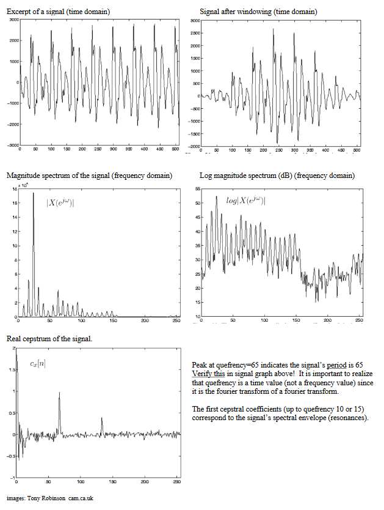

# Cepstral Pitch Detection

**Cepstral pitch detection** is the process of analyzing the [[cepstrum]] of an [[audio-signal|audio signal]] to determine the signal's [[fundamental]] [[frequency]]/[[pitch]], usually that of an instrument or vocalist.

## Equation

The function $c_x[n]$ represents the real [[cepstrum]] of a signal; the input $n$ represents the **_quefrency_** (measured in time) of the original signal. Peaks/maxima in $c_x[n]$ correlate to the fundamental period of the signal.

$$
c_x[n] = \frac{1}{2\pi} \int^\pi_\pi log|X(e^{j\omega})| e^{j\omega} d\omega
$$

## Steps

1. Begin with an original signal, measured in the [[time-domain|time domain]]
2. [[spectrum-analysis-window|Window]] the signal in preparation for [[fast-fourier-transform|FFT]]
3. Use FFT to get the magnitude [[spectrum]] $|X(e^{j\omega})|$ of the signal in the [[frequency-domain|frequency domain]]
4. Get the log magnitude spectrum, $log|X(e^{j\omega})|$ (measured in dB)
5. Take the [[fourier-inversion-theorem|inverse Fourier transform]] to obtain the real cepstrum $c_x[n]$

## Notes

The first few cepstral coefficients (around quefrency 10-15) represent the signal's [[spectrum|spectral]] [[envelope]] (the [[resonance]]s).

Using logarithms does a few things:

- brings out quieter [[partial]]s, which is important if the fundamental is quieter than the [[harmonic]]s
- logarithms emphasize equal spacing, which helps boost the fundamental in the cepstrum

## Sources

- ECE 402 Lecture 20
