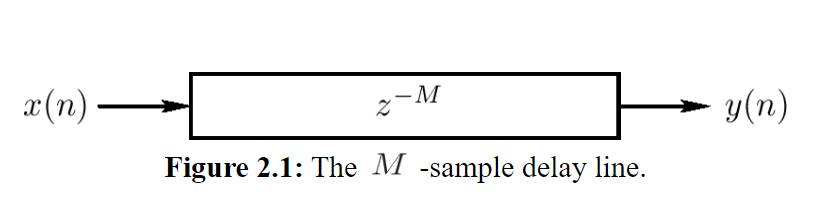

# Delay Line

A **delay line** is an elementary, functional [[audio-signal|audio signal]] processing unit that models "acoustic propagation delay", i.e. it introduces a time delay between its input and output signal.

- fundamental building block of [[digital-delay-line|digital delay effects]] and digital [[sound-synthesis|synthesis]] models

## Localization

Delays as they occur in nature are essential cues for our biological and auditory ability to recognize the placement of sounds in our environment.

- crucial skill for survival

Human auditory system relies on sound delays as an important cue for [[localization]] of sources.

Delays can be exploited for creative spatial effects or localization cues.

## Sources

- <https://ccrma.stanford.edu/~jos/pasp/Delay_Lines.html>
