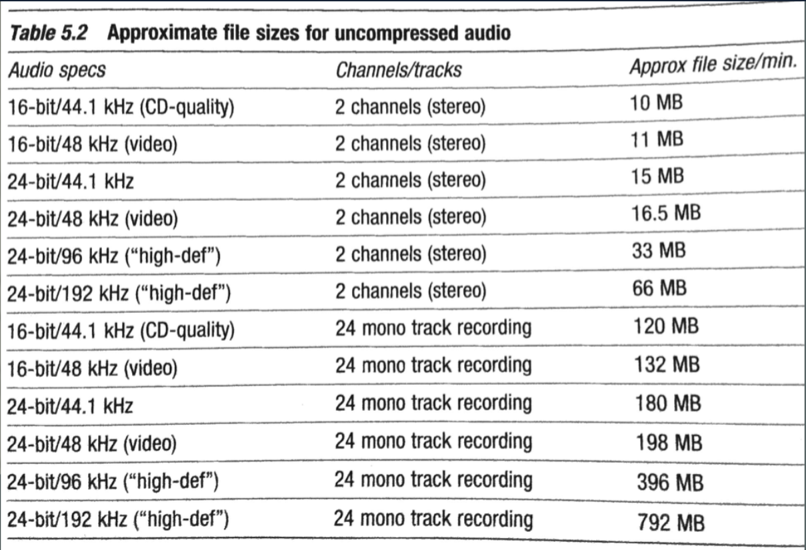
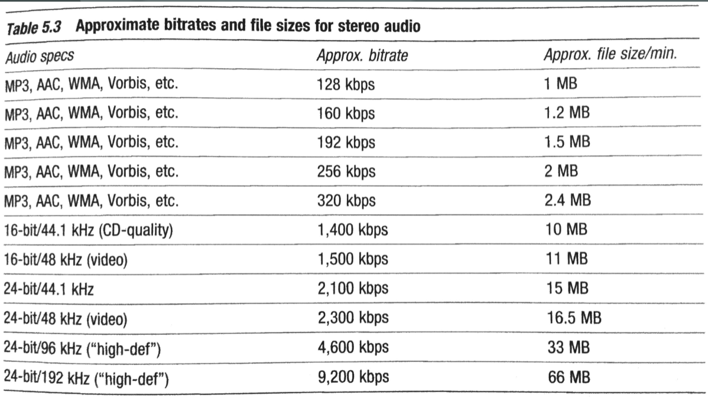

# Digital Audio File Formats

- [Digital Audio File Formats](#digital-audio-file-formats)
  - [Uncompressed File Formats](#uncompressed-file-formats)
    - [Uncompressed File Size](#uncompressed-file-size)
  - [Compressed File Formats](#compressed-file-formats)
    - [Lossy Compression](#lossy-compression)
    - [Lossy Compression File Size](#lossy-compression-file-size)
  - [Sources](#sources)

[[digital-audio|Digital audio]] [[sampling-signal-processing|samples]] are stored in a standardized file format, which determines what information is stored. There are two broad categories:

1. **Uncompressed**: data stored in full resolution
2. **Compressed**: data size is reduced
   1. **Lossless compression**: original uncompressed data is recoverable
   2. **Lossy compression**: Original uncompressed data is permanently lost

## Uncompressed File Formats

Among the most common formats are:

- **AIFF** (audio interchange file format)
  - Apple, 1988, `.aiff` or `.aif`
- **WAVE** ([[waveform]] audio file format)
  - Microsoft/IBM, 1991, `.wav`

Both formats exhibit the following characteristics:

- typically encoded via linear [[pulse-code-modulation|pulse-code modulation]] (LPCM)
- are full-resolution: every digital sample stored as a `16`, `24`, or `32` [[bit]] value
- include header information at beginning of file
  - [[sample-rate|sample rate]], [[bit-depth|bit depth]], number of channels, metadata, etc.

### Uncompressed File Size

How many MB per minute in an uncompressed audio file?

Known conversions:

- 8 bits = 1 [[byte]]
- 1 MB = 1 million bytes
- 60 seconds = 1 minute

Calculation:

```text
sample rate (samples/sec)
* bit depth (bits/sample) = bits/sec
/ 8 (bits/byte) = bytes/sec
* 60 (sec/min)= bytes/min
/ 1000000 = megabytes/min
* number of channels
```

Results:

- 1 min of stereo 44.1k/16b AIFF/WAV: **approximately 10.5 MB**
- 1 min of stereo 192k/24b AIFF/WAV: **approximately 70 MB**

For comparison, the original 1984 Apple Macintosh could hold approximately 2.3 seconds of stereo 44.1/16 uncompressed audio.



## Compressed File Formats

In _lossless_ compressed audio, file size is reduced, but data can be restored.

- e.g. repeated sample values stored as a single value and number of repeats
- `.wma` (Windows media audio, lossless)
- `.flac` (free lossless audio codec)

Some lossless formats are capable of storing audio in lossy format, e.g. original WMA format. Likewise, some uncompressed formats also support compressed audio, stored in header data.

In _lossy_ compressed audio, file size is reduced, and original data is permanently lost.

- `.mp3` (MPEG-1 and MPEG-2, audio layer III)
- `.AAC` (advanced audio coding)

### Lossy Compression

Lossy compression relies on _perceptual encoding_, where the nuance of human perception determines which data is removed.

Perpetual encoding [[algorithm]]s identify regions imperceivable by [[masking]] and assign fewer bits to these samples.

### Lossy Compression File Size

Lossy compression involves choosing a bitrate (kbits/sec).

- e.g. 128, 256, 320 kbits/sec (other bitrates possible)
- bitrates can be constant or variable during encoding

How many MB per minute in an uncompressed audio file?

Calculation:

```text
bitrate (kbits/sec)
/ 8 (bits/byte) = kbytes/sec
* 60 (sec/min) = kbytes/min
/ 1000 = megabytes/min
```

1 min 128 kbps mp3: approx. **1 MB** (about 1/11t the size of CD-quality audio)



## Sources

- MUS 407 Digital Audio
