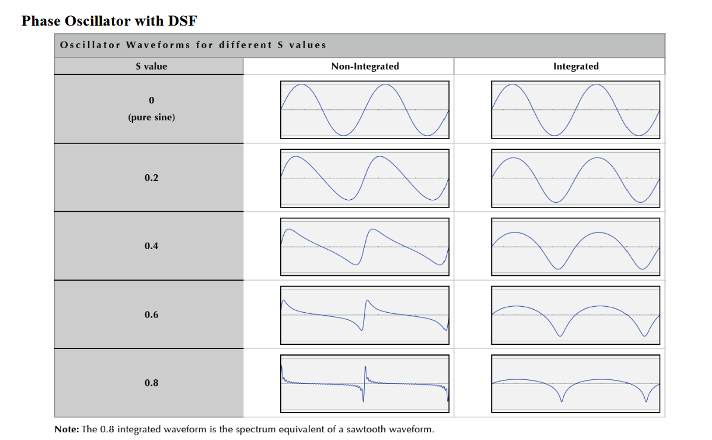

# Discrete Summation Formula (DSF)

DSFs can be used to generate [[bandlimiting|bandlimited]] [[waveform|waveforms]]. The DSF technique efficiently evaluates _sums of exponentials_ using the following:

$$
\sum^K_{k=1} r^k = \frac{r(1-r^K)}{1-r}
$$

## Structure

[[phase-oscillator|Phase oscillators]] with the following structure can be used in place of wavetable memory:

$$
DSF = \sum^K_{k=1} e^{-k \alpha} \cdot Im \{ e^{jk2\pi \theta} \}
$$

where $\alpha = 3(1-S^3)$.

In musical contexts, $S$ is a "musically useful" [[timbre]] parameter to control, with values ranging from 0 to 1.

- $S = 0.8$ creates a "musician's [[sawtooth-wave|sawtooth]]", which starts out closer to -8 [[decibel|dB]]/octave and falls off faster at high octaves
- similar to Moog Voyager Sawtooth, which has a dip near 3 kHz for a "creamy" sound

## Sources

- ECE 402 Lecture 17
