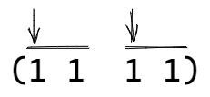

# Duyug/Sirong

**_Duyug_** and **_sirong_** are [[kulintang-rhythmic-modes|kulintang rhythmic modes]] with musical phrases two beats in length, with emphasis at the beginning of each beat.

- _Duyug_ means "accompany", used by Datu Piang musicians and other upriver [[maguindanao|Maguindanaon]]
  - relates to the kulintang played in [[palabunibunyan|ensemble]] or at weddings in the past
- _Sirong_ means "shade" or "shelter", used in Cotabato City, Simuay, and other downriver areas

## Rhythm

In duyug/sirong, all [[palabunibunyan]] players play phrases two beats in length, with emphasis at the beginning of each beat.

- the beginning of each beat is accented to signal an opportunity for creativity in improvisation
- the weak beats (sub-units) can be repeated or altered
- while improvising, players can either introduce new sub-units or reintroduce previously utilized sub-units
- stylistic options, like doubling of strokes, striking two gongs at the same time, or alternative uses of upper/lower gongs can be used in conjunction with repetition

## Form

_Duyug/sirong_ pieces begin and end with some conventions:

- pieces begin with gong 3, sometimes in conjunction with gong 2
- final section contains new musical phrases and ascent to gong 7
- _duyug/sirong_ pieces always end on gong 3 or 5 on beat 1

## Sources

- [The Maguindanaon Kulintang: Musical Innovation, Transformation and the Concept of _Binalig_ by Kristina Benitez (Thesis)](https://deepblue.lib.umich.edu/handle/2027.42/125019)
