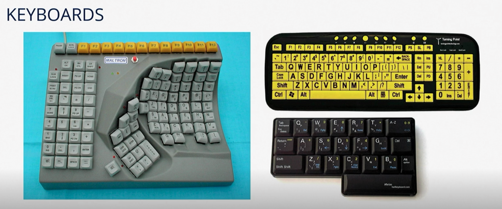
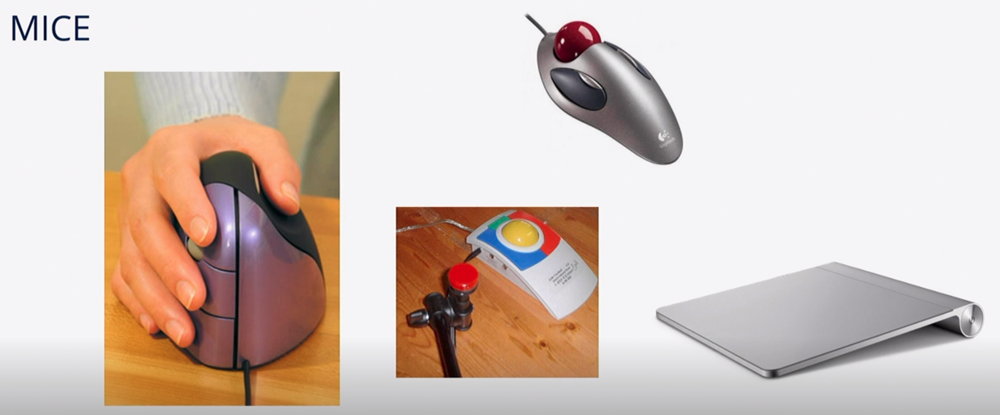

# Electronic Aids to Daily Living and Computer Access

**Electronic aids** to daily living (EADL) are devices used to access, operate, and control electronic appliances.

Items that can be controlled:

- Bed
- Lights
- Appliances
- Audio visual (AV) equipment
- HVAC
- Windows
- Anything that can be plugged in

Who benefits from an EADL?

- Anyone with significant functional limitations
  - [[spinal-cord-injury|spinal cord injury]]
  - s/p [[cerebrovascular-accident|CVA]]
  - [[cerebral-palsy|cerebral palsy]]
  - muscular dystrophy
  - ALS
  - etc.

## Advanced Control System

- Computer based systems
- Control appliances through
  - Internet/Wi-fi
  - Electric wiring
  - Bluetooth
  - Infrared
  - Motion/sound effects
  - Other direct connections for unique devices

## Interface of EADL

- Standalone
  - enhanced programmability
  - less expensive vs. computer
- Computer/Tablet/Phone based
  - integrated with devices the client already uses
  - enhanced ability to control the device
- Access:
  - direct selection
  - switches
  - voice activated

## Computer access

- Programs to enhance an individual's ability to interact with a computer - requires software, hardware accommodations

### Software

- Voice activation
  - For: individuals with limited hand function
  - control computer with your voice
  - dictation
  - ex. Dragon Naturally Speaking
- Screen reader
  - for: individuals with visual limitations or trouble reading
  - text on screen is read to user
  - ex. JAWS (Job Access with Speech), Kurzweil Reader

### Hardware

### Brain computer interface

- Emerging field of assistive technology
- Electrodes are implanted in a person's brain
- Able to control prosthetic devices and feel sensations

## Sources

- REHB 330
