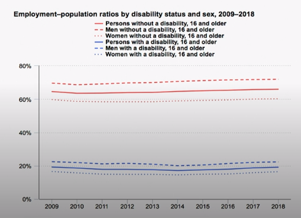
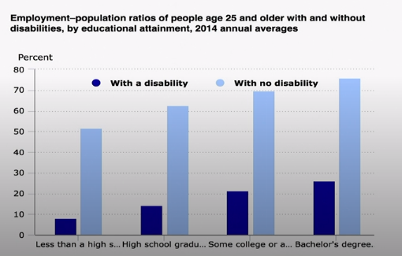
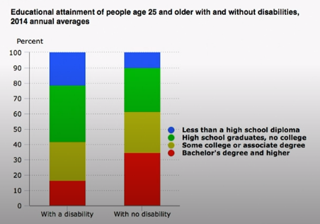

# Employment Disparity

## Employment Discrimination

Individuals with [[disability|disabilities]] are often treated differently in the workplace. They often

- are unable to apply for jobs
- are not offered a job
- experience an employer unwilling to make reasonable accommodations
- face discrimination in the workplace
  - passed over for promotion
  - unequal wages and [[income-inequality|income inequality]]

## Importance of Employment

- Financial impact - having money is very important
- Employment results in personal growth/challenge
- Gives sense of responsibility and community
- Opportunity for social relationships
- Development of a routine

## Income statistics

Median household income:

- persons without disabilities - $65,400
- persons with disabilities - $36,000

## Divide starts early

Children with disabilities do not always receive the same educational opportunities

- legislation helps, but many opportunities are still lost

## Education of All Handicapped Children Act

- Signed into law in 1975
  - Not implemented until 1977
- Applies to public schools that accept federal funds
- Guaranteed equal public education for children with disabilities
- Schools must evaluate children with disabilities and develop an education plan
- Later renamed: The Individuals with Disabilities Education Act (IDEA)

## Segregation in Primary School

- Physical structures
  - Access to toys
  - Sitting in traditional desks
  - Navigation around building
    - Children with disabilities have to navigate crowded hallways with [[assistive-technology|assistive technology]]
- Formation of social groups
- Access to recreational activities
  - Sports
  - Dance classes

## Segregation in high school

- Tight formation of social groups
- Relationships
- Unique educational opportunities, ex. participating in internships
- Receiving poor advice for the future from counselors
  - Counselors may have limited information or not understand what a student with a disability is able to achieve

## Problems for students with disabilities in higher education

- physical or intellectual disabilities can make college more difficult
  - students with disabilities often have more difficulty adjusting to college life
  - postsecondary education disability culture is very different
    - non-centralized classroom system
    - assistant structure (strangers often have to serve as personal assistants)
- only about 21.9% of students with disabilities complete their program of study compared to 43% of able-bodied students
- enrollment of persons with disabilities has increased more than 20% from 2003 to 2009
  - rates of employments are still low!

## Need for secondary education

Postsecondary degrees are important for stable employment

- particularly for those with disabilities, post secondary provide many more opportunities
- more "desk" jobs
- unique skills are more valuable to an employer

## Sources

- REHB 330 4.2.1 Employment Disparity
