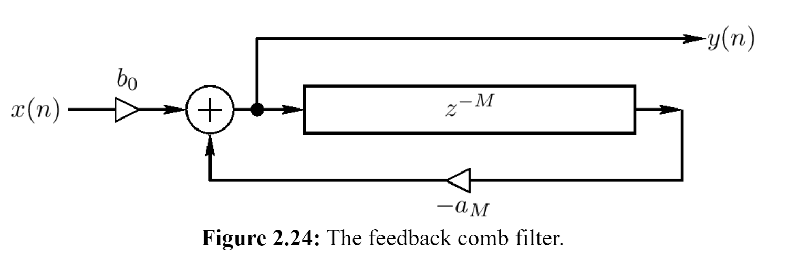

# Feedback comb filter

The **feedback comb filter** uses feedback in its design as opposed to a feedforward signal like its counterpart.

The feedback comb filter is an example of an [[infinite-impulse-response|IIR]] digital [[filter]]. It can be regarded as a computational physical model of a _series_ of echoes.

## Implementation

Comb filters are just **[[digital-delay-line|delay lines]] with [[feedback]]**

- feeding signal into itself with an extremely _short delay time_, to the point of hearing a periodic waveform
- any [[partial]] with aligns with the inverse of the delay time (and all the [[harmonic]]s of that partial) will experience 100% [[wave-interference|constructive interference]]
  - creates peaks in the [[spectrum]]
- conversely, any harmonic that has 1.5/2.5/3.5/etc. times the [[frequency]] of the original partial will experience 100% [[wave-interference|destructive interference]]

## Uses

We can use feedback comb filters to model infinite [[echo|echoes]]:

$$
y[t] = x[t] + gyt[t-N]
$$

This is useful for implementing digital [[reverb]].

## Sources

- <https://ccrma.stanford.edu/~jos/pasp/Feedback_Comb_Filters.html>
