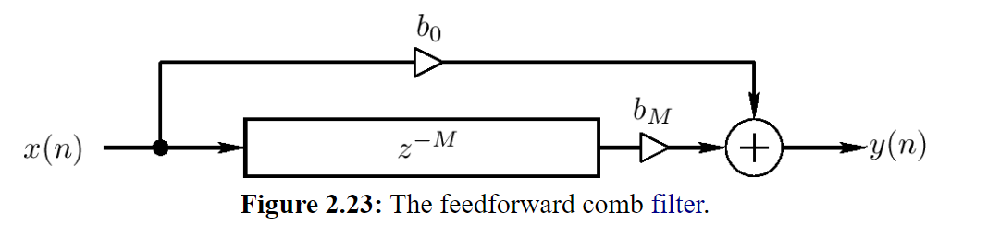

# Feedforward comb filter

The **feedforward comb filter** "feeds forward" around the [[delay-line|delay line]], and its output is a linear combination of the direct and delayed [[audio-signal|signal]].

The feedback comb filter is an example of an [[finite-impulse-response|FIR filter]]. It can be regarded as a computational physical model of a _single echo_.

## Sources

- <https://ccrma.stanford.edu/~jos/pasp/Feedback_Comb_Filters.html>
