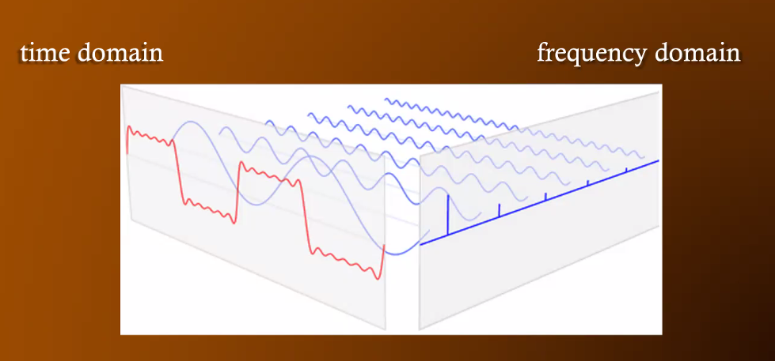
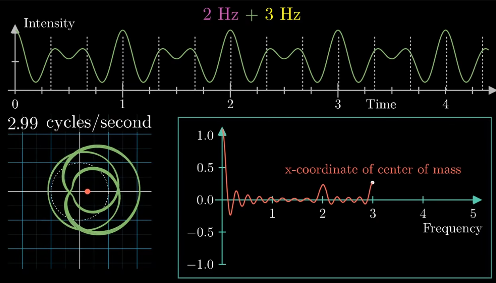

# Fourier Transform

A **Fourier Transform** is a mathematical tool for _frequency decomposition_, used to decompose a signal into its pure, single-frequency components.

- from MUS 409: a mathematical operation mapping a continuous signal to amplitude/phase data corresponding to spectrum
  - i.e. conversion of time domain to frequency domain

In practice, Fourier transforms are often used with [[fourier-inversion-theorem|inverse Fourier transforms]]: reproducing a signal (intensity over time) _from_ a Fourier Transform (intensity in terms of frequency)

The Fourier transform of an intensity vs. time graph, usually $g(t)$, is a new function $\hat{g}(t)$, which:

- doesn't have time as an input, but instead takes a _frequency_ (the "winding" frequency)
- outputs a complex number, some point in the 2D plane, that corresponds to the strength of a given frequency in the original signal

$$
\hat{g}(f) = \int^{t^2}_{t_1}g(t)e^{-2 \pi i f t} dt
$$

Key concepts for understanding this function:

- exponentials correspond to rotation (Euler's number)
- multiplying the exponential by the original input $g(t)$ means drawing a wound up version of that graph around the origin
- an integral of a complex valued function can be interpreted in terms of a center-of-mass idea

## Sound

Fourier transforms are used in [[spectral-analysis|spectral analysis]] to decompose and isolate [[frequency|frequencies]] from [[sound-waves|sound]].

## Example (MUS 409)

- A DFT of a digital recording of Stravinsky's _Rite of Spring_ (or some other really long piece)
- Treat the entirety of the piece as one period of a complex vibration
- DFT derives amplitude/phas einformation for the fundamental, 2nd harmonic, 3rd harmonic, etc. through N
  - note that the "fundamental"i n this case is vastly below our range of hearing - around 0.00056 Hz if the piece is 30 minutes long
- when summed together, frequency components perfectly reconstruct the original time domain signal
- FFT tells us the sinusoidal components we need to reconstruct this piece of music in its entirety, but not enough information to tell where components of certain sinusoidal segments of a piece are located
- To do this, we have to take STFTs

## Sources

- [But what is the Fourier Transform? A visual introduction (YouTube)](https://www.youtube.com/watch?v=spUNpyF58BY)
