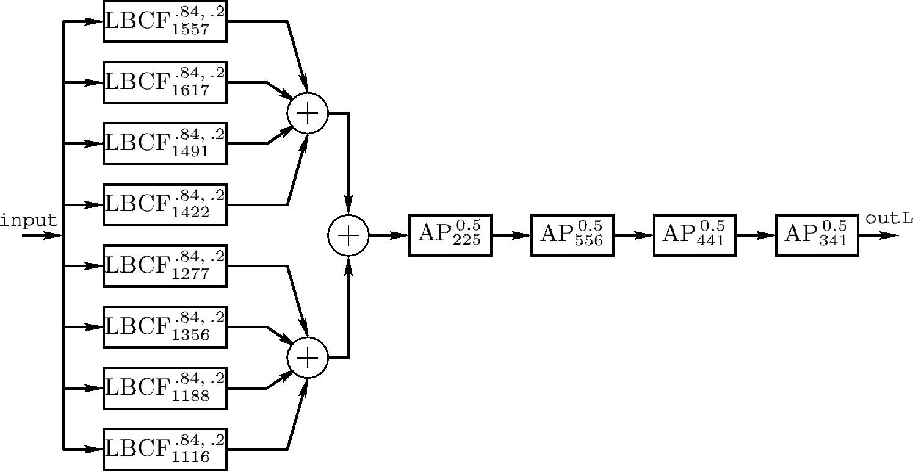

# Freeverb

**Freeverb** is a public domain [[reverb]] [[algorithm]] developed by "Jezar at Dreampoint". It uses four Schroeder [[all-pass-filter|all-pass filters]] in series and eight parallel Schroeder-Moorer filtered-feedback [[comb-filter|comb-filters]] for each [[audio-signal|audio]] channel.

The original version was written C++. Ian Hobson has written a version in [[rust|Rust]] for an ADC 2018 talk.

## Sources

- <https://ccrma.stanford.edu/~jos/pasp/Freeverb.html>
- [Ian Hobson - An introduction to Rust for audio developers](https://www.youtube.com/watch?v=Yom9E-67bdI)
