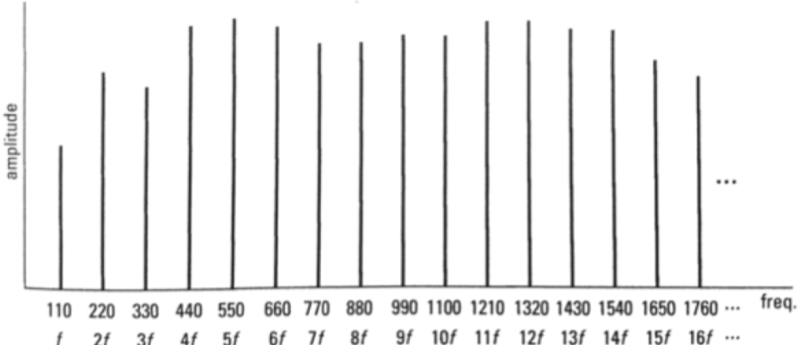

# Frequency Domain

The **frequency domain** is a representation of signals or waves (including [[sound-waves|sound waves]]) where axes are labeled as follows:

- x-axis: [[frequency]]
- y-axis: [[amplitude]]

We can analyze the [[spectrum]] of a sound with this domain.

A limitation of frequency domain is that we get no temporal information.

## Sources

- [MUS 407 Sound, Acoustics, & Psychoacoustics](https://prezi.com/view/ZcqvwosFJCFJQtQrbP75/)
- CS 448
