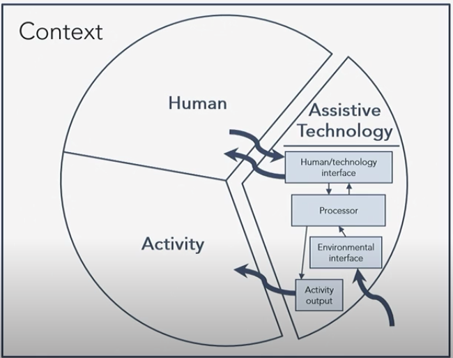
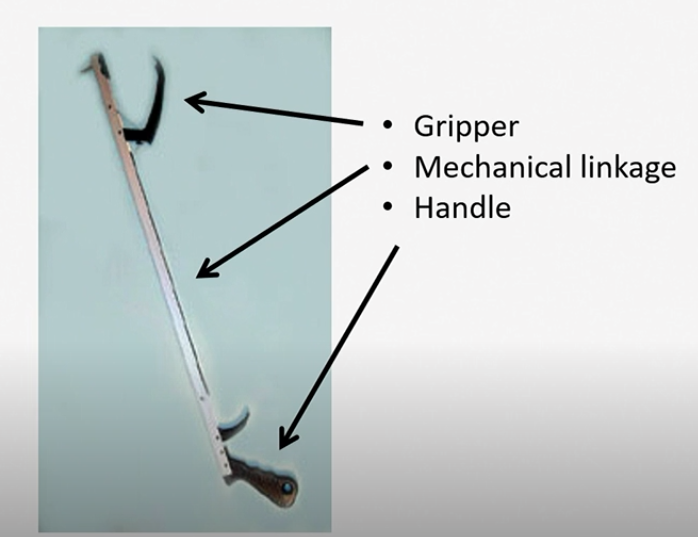

# HAAT Model

The Human Activity Assistive Technology model was developed to

- select the most appropriate [[assistive-technology|assistive technology]]
- analyze the complexities of someone (a person with a [[disability]])
  - doing something (an activity)
  - somewhere (within a context)
  - when the use of assistive technology is part of that context

## Components

**Human** - an individual with a disability controlling the system

- Assessment: how well can the person control the system?
  - sensory input
  - central processing
  - motor output

**Activity** - the specific thing that the person wants to do

- defines the goal of the AT system

**Assistive Technology** - equipment that allows the human to perform the desired activity

**Context** - additional component

- where the activity is being performed (e.g., school, home, community, work)
- under what conditions (e.g. light, sound, heat, proximity of others)
  - ex. is the device loud enough in noisy environments?

## AT Flow Components

Human/technology interface

- Boundary between human and AT
- Two-way interaction
- Information and forces may be directed from person to AT and vice versa

Activity output

- performance of a functional activity
- how will the technology actually perform in the environment?

Processor

- linkage between the human/technology interface and the activity output
- translates information and forces received from the human into signal that is used to control the activity output

Environmental interface

- "Smart technology" that senses input from the environment
- Only very complex assistive technologies have this component

## Sources

- REHB 330
