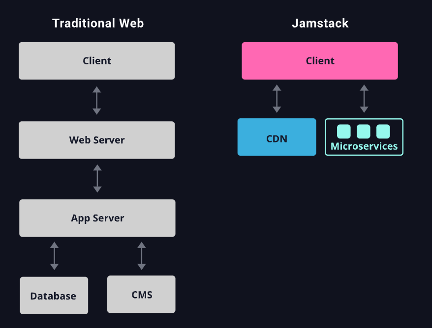

# Jamstack

**Jamstack** is a web development architecture pattern for building websites. Sometimes stylized as "JAMstack", where:

- **J**: [[JavaScript]]
- **A**: [[application-programming-interface|APIs]]
- **M**: Markup

Jamstack is used for the following design features:

- frontend is decoupled from backend
- frontend is primarily static-first, with dynamic functionality (through [[javascript|JavaScript]]) only as necessary
- progressively enhanced with JavaScript only as needed

## Sources

- <https://jamstack.wtf>
- <https://jamstack.org>
