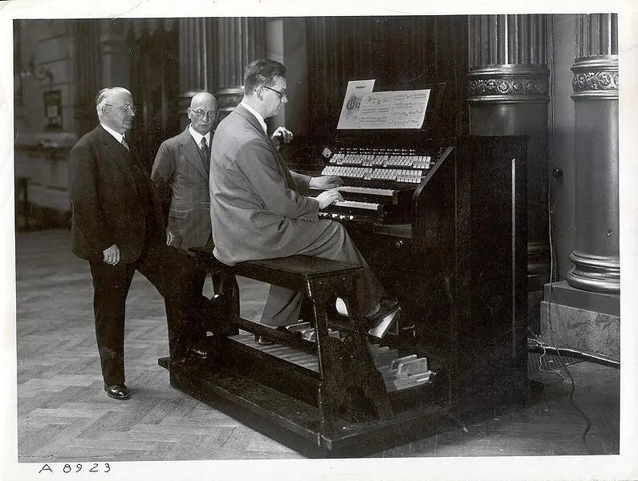

# Light Tone Organ

The **Light Tone Organ** is a photoelectric instrument invented by Edwin Welte in Germany in 1936. It was an early [[sampling-composition|sampling]] instrument that encoded [[waveform|waveforms]] as patters on rotating glass discs.

Playback was facilitated by rotating the discs across photoelectric cells, which would read the encoded waveforms. A filtered light beam controlled the [[pitch]] and [[timbre]] of the instrument based on the encoded samples.

It was largely destroyed in 1944 WWII allied bombings.

## Sources

- MUS 407 Sampling
- <https://120years.net/wordpress/the-welte-licht-ton-orgele-weltegermany1936/>
