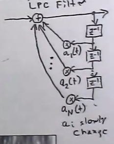

# Linear Predictive Coding

**Linear predictive coding (LPC)** is a method for representing the [[spectrum|spectral]] [[envelope]] of a [[digital-audio|digital]] signal of speech in compressed form.

LCP is used in a variety of contexts:

- [[audio-signal|audio signal]] processing
- speech processing
- speech analysis
- speech coding
- speech/cross synthesis

## Cross Synthesis

LPC is used in [[cross-synthesis|cross synthesis]] to generate new [[sampling-signal-processing|samples]] for a signal based on predictions from past samples of the signal.

This transfer function uses $N$ past samples to generate new samples:

$$
\hat{s}(n) = \sum^N_{i=1} a_i \cdot s(n-i)
$$

This function is an example of an _all-poll filter_ (or "resonant filter")

- for music, about 20-60 previous samples are used to predict new ones ($N=[20,60]$).
- speech uses less samples than music
- filter coefficients $a_i$ are known as **prediction weights**

The _residual_ (aka _prediction error_ or _error function_) is the ideal excitation for the LPC filter, producing the original samples out of the filter.

$$
e(n) = s(n) - \hat{s}(n) = s(n) - \sum^N_{i=1} a_i \cdot s(n-i)
$$

Prediction weights $a_i$ are chosen to make the residual small (low-energy) and flat [[spectrum]] (called "white" or "random", similar to [[noise]]).

- sequences of glottal pulses are often approximated by impulse train (flat spectra)
- whisper breath is often approximated by random noise (flat spectra)
- any broadband music input (ex. fuzz guitar, ocean noise) works well with LPC

Musical use: one sound's spectrum shapes another sound.

### LPC Frame Rate

An LPC Frame is a set of filter coefficients $a_i$ generated to match changing [[resonance]]s over time, where the formants and higher [[partial]]s move over time.

- used to match the changing mouth shape of speech or singing
- the _frame rate_ is the time between successive filter coefficient updates

In musical applications, the frame rate is often greatly modified during [[sound-synthesis]] for extra time-stretch, time-reversal, or other effects.

- most software uses [[linear-interpolation]] between $a_i$ coefficients of different frames (considered not the most accurate but passable)

## Speech Compression

LPC is commonly used in speech compression. For speech, $N$ is much smaller ($N \approx 10$), so there are not many values to send for every coefficient update (frame rate = 5-10ms).

- residual often approximated by selecting from a "codebook" of 128 standard excitation functions, thus taking only 7 bits to encode (CELP)

## Sources

- <https://en.wikipedia.org/wiki/Linear_predictive_coding>
- ECE 402 Lecture 19
