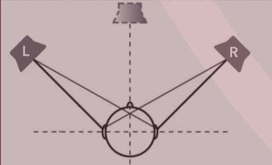

# Localization

**Localization** is the ability for us to tell where a [[sound-waves|sound]] comes from.

- with two ears, we can perceive sound in 3 dimensions

This allows for two important functions:

- focusing on one direction only
- locating where a sound is coming from

## Monitoring with loudspeakers

If two equidistant [[loudspeakers]] reproduce the same [[audio-signal|signal]], source "image" appears in-between.

- if one speaker is louder than the other, sense of direction shifts
- if a small [[digital-delay-line|delay]] is introduced in `L`, perceived image shifts towards `R`
  - delayed signal is interpreted as environmental echo, reinforcing perceived location of earlier sound
- [[psychoacoustics|psychoacoustic]] principle called **Precedence Effect** or **Haas Effect**

## Microphone arrays

[[microphone-array|Microphone arrays]] are good for localizing sound in space. This has many uses:

- steering a [[beamformer]]
- moving teleconference cameras
- help robots orient with sound
- locate whales and submarines in the ocean
- detect nuclear explosions

For front back localization, you need two microphones.

For 3D localization, you need at least four microphones.

## Sources

- MUS 407
- CS 448 Microphone Arrays
