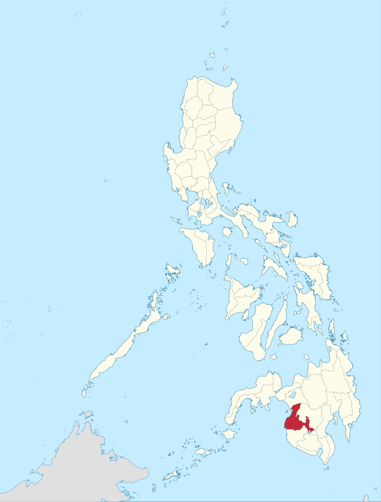

# Maguindanao

**Maguindanao** is a southern province in the [[Philippines]], located on the island of [[Mindanao]]. It is situated along the banks of _Pulangi_, a major waterway that tends to overflow and turns the surrounding valley into a vast lake (_danao_).

## The Maguindanaon

The _Maguindanaon_ people live in Maguindanao and take their name from the province.

They identify each other as "people of the upstream" (_tao sa raya_) or "people of the downstream" (_tao sa ilud_) of the river _Pulangi_. They were the dominant people in Mindanao until Spanish colonials subjugated them by force - however, to this day, "their spirit remains unconquered" (Benitez).

The Maguindanaon revere the [[kulintang]] as their most important musical instrument today, which can be played solo or in an [[palabunibunyan|ensemble]] of drums and varying combinations of hanging gongs.

## Sources

- [The Maguindanaon Kulintang: Musical Innovation, Transformation and the Concept of _Binalig_ by Kristina Benitez (Thesis)](https://deepblue.lib.umich.edu/handle/2027.42/125019)
