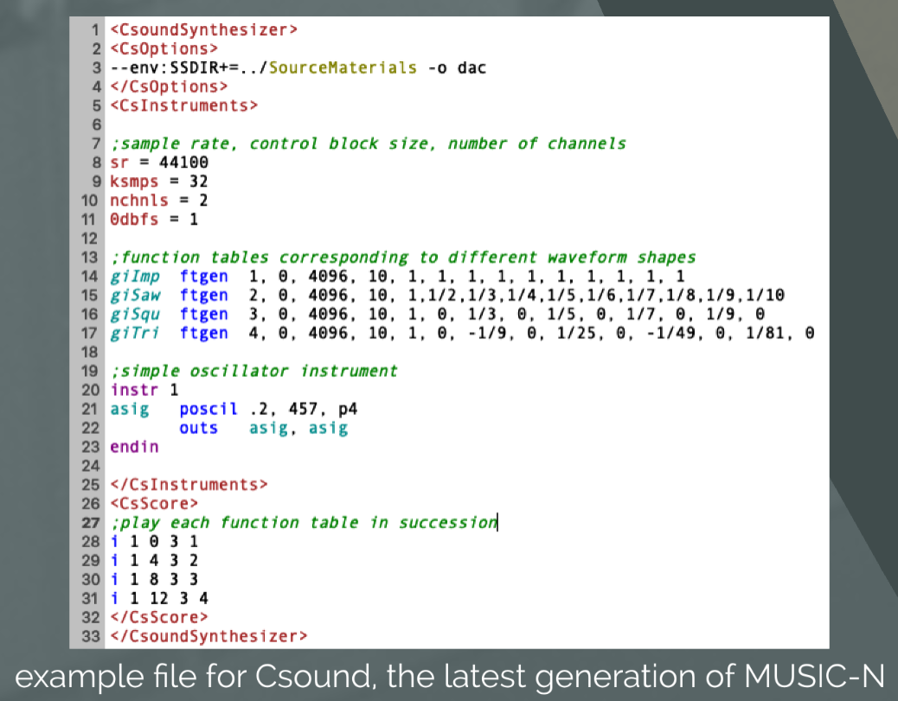

# MUSIC-N

## Beginnings

Early developments at [[bell-laboratories|Bell Telephone Laboratories]], NJ, early 1950s

In 1957, **Max Mathews** created and oversaw the first sound-generating computer program, called **MUSIC**

- triangle wave only
- no control over [[envelope]] [[transient|transients]] or [[timbre]]
- only [[pitch]], [[loudness]], and duration were controllable
- "it was terrible" - Max Mathews
- Max (1926-2011) is also namesake of eponymous Max/MSP software

See: 17-second [[music-composition|composition]] by Newman Guttman (Bell Labs linguist/acoustician) titled _In the Silver Scale_

See: IBM 704 Computer, on which the MUSIC program ran

Punch cards were used for programming early computers. FORTRAN statements were written on punch cards and then processed by the computer.

## Continued Development

Mathews & others continued developing MUSIC

- **MUSIC II** (1958), capable of four simultaneous voices, 16 possible [[waveform|waveforms]]
- **MUSIC III** (1960), introduction of 'unit generators', more modularity
- MUSIC IV (1962), 'orchestra/score' paradigm, strongly resembling modern-day descendent, _CSound_
  - Orchestra: define voices and their timbres
  - Score: define notes for each voice

1960s integrated circuits (ICs) and microprocessor revolution necessitated substantial rewrites

**MUSIC V** (1966) written in Fortran, earlier version written in Assembly.

Later versions: MUSIC 10, MUSIC 11, MUSIC 360 (Barry Vercoe, 1968)

Collectively known as the **MUSIC-N** family of programming languages.

