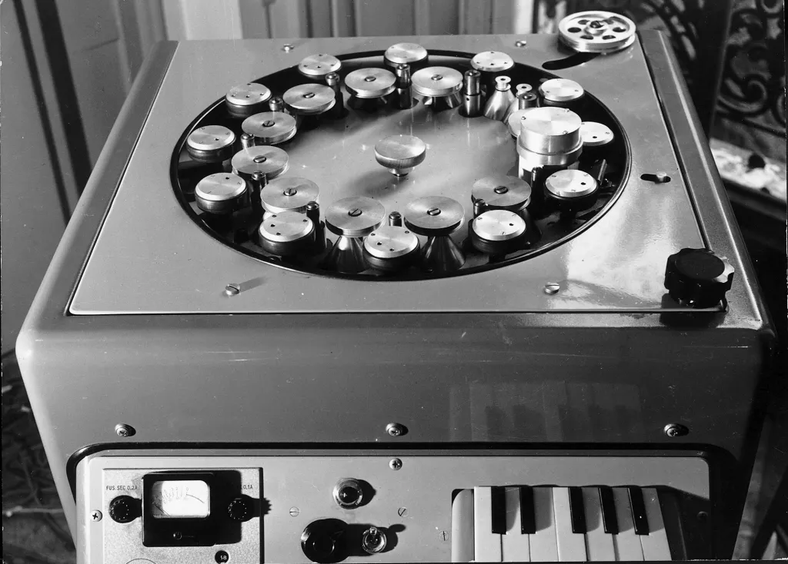

# Phonogène

The **Phonogène** is an early [[sampling-composition|sampling]] instrument invented by [[pierre-schaeffer|Pierre Schaeffer]] in Paris in the 1950s.

- mini [[tape]] players, like a keyboard for sampling

The phonogène consists of twelve tape capstans of differing diameters. A key press engages on capstone and moves a tape loop across a playhead at a specific rate corresponding to the [[pitch]] of the key being pressed.

## Sources

- MUS 407 Sampling
- <https://120years.net/wordpress/the-grm-group-and-rtf-electronic-music-studio-pierre-schaeffer-jacques-poullin-france-1951/>
