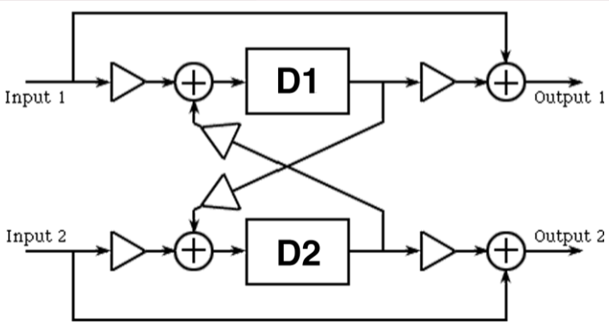

# Ping-Pong Delay

**Ping-pong delay** is a [[fixed-delay-effects|fixed delay effect]] where a pair of [[digital-audio|audio]] channels are delayed and fed back to each other.

When routed to L/R [[loudspeakers|speaker]]s, ping-pong delay gives the impression of a sound "bouncing" back and forth across the stereo field, like a ping-pong ball.

