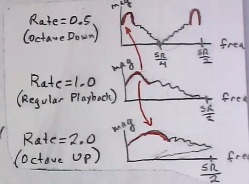

# Pitch Shifting

**Pitch shifting**, in this context, is the process of changing the [[pitch]] of some audio sample in playback.

- there are methods to [[pitch-shifting-realtime|pitch shift in realtime]], which utilizes [[variable-delay-effects|variable delay lines]], but the process in this note is different

## Naïve Method

The naïve method to pitch shift is to play back a sample at a different rate.

- a normal playback would be at rate 1.0
- a faster playback would be at rates > 1.0 (ex. octave up would be rate 2.0)
- a slower feedback would be at rates < 1.0 (ex. octave down would be rate 0.5)

This method raises several problems:

- any vibrato or tremolo changes speed
- the onset time and [[transient]] shape changes with the sustain, changing the overall [[envelope]]
- note length speeds up or slows down
- the [[spectrum]] has large changes, causing the spectral envelope to shift and moving the [[resonance]]s/formants
  - think "chipmunk" effect when going up or "inflated head" effect when going down
- playing at a lower rate results in high energy buildup near the Nyquist frequency, resulting in artifacts
- playing at a higher rate results in [[aliasing]]

There are a few fixes to these problems:

- interpolating to fractional samples in sample file helps a little, but all problems persist
- insert zeros (for speech) - adding zero samples before glottal pulses reflects mouth shape (resonances, decay rates), even at different pitches
- use an entirely different algorithm, such as Lent's algorithm

## Sources

-
