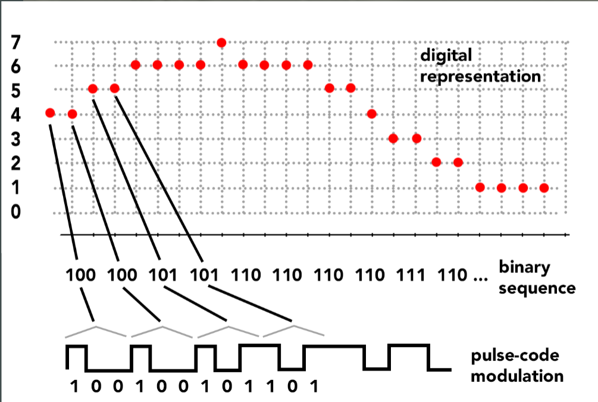

# Pulse Code Modulation

**Pulse Code Modulation (PCM)** is a specification for computer digitization of [[analog-audio|continuous signals.]]

- patented by Alec Reeves, 1938
- became one of the primary standardizations for digital representation of analog [[audio-signal|signal]]s for [[digital-audio|digital audio]]

For PCM with bit depth of 8 or lower, sample values are usually unsigned as a convention.

- in most [[programming-language|programming languages]], a collection of samples can be represented as an array
- all [[digital-signal-processing|digital audio processing procedures]] are just functions that act on an array of audio samples

## Sources

- MUS 407 Digital Audio
- [mu (wave)](https://mu.krj.st/wave/)
