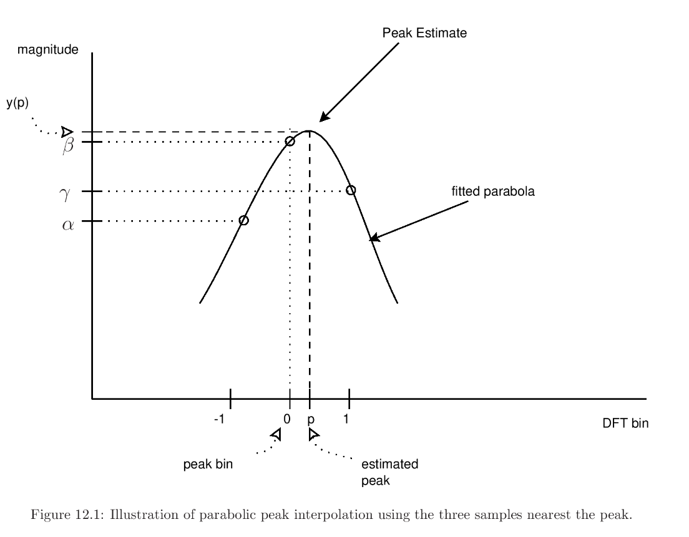

---
tags:
---

# Quadratic Interpolation

**Quadratic interpolation** is the process of generating values between points in space by forming a quadratic function that passes between each of the points.

## Spectral Analysis

In [[spectral-analysis|spectral analysis]], the main lobe of a [[spectrum-analysis-window|window]] is replaced by a quadratic polynomial, or parabola.

- valid for any practical window transform in a sufficiently small neighborhood about the peak
- quadratic spectral peak interpolation is _exact_ under the Gaussian window, although the infinitely long tails must be removed
- utilized by Serra and Smith for SMS ("Smith Interpolation")

## Sources

- <https://ccrma.stanford.edu/~jos/sasp/Quadratic_Interpolation_Spectral_Peaks.html>
