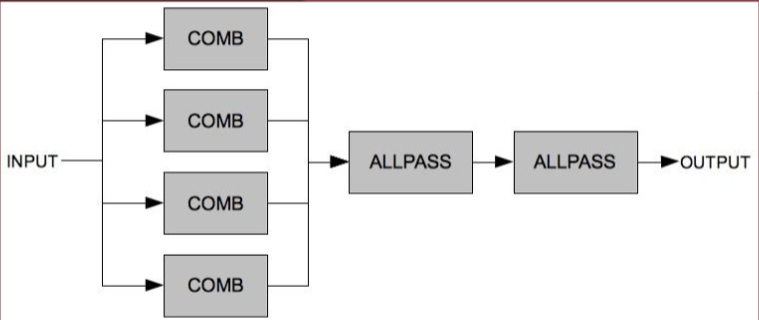

# Reverb

Broadly, **reverb** encompasses effects that rooms impose on [[sound-waves|sounds]].

- desirable effect for music, movies, video games
- undesirable effect for most speech recordings

What you hear in a room is a sound _and_ all of its echoes (and their subsequent echoes) as they reflect off surfaces.

- an exception is in [[anechoic-chamber|anechoic chambers]]

In [[audio]], **reverb**, or _reverberation_, is a [[fixed-delay-effects|fixed delay effect]] where many delay lines work together to simulate reflections of a sound source in order to simulate room/hall acoustics.

- analog reverb implementations with physical objects
- numerous digital reverb [[algorithm|algorithms]] in existence
- usually, a large combination of [[feedback]] delays with different short/medium delay times, in parallel and series

Delay times usually do not vary dynamically

- because room dimensions do not vary dynamically!
- variable delay times can be used for doppler effect and other weird, custom reverb-like effects

## Side effects

- Echoes (repeating the input after a while)
- Coloring (changing the [[spectrum]] of the input)

## Anatomy of a reverb

Three main parts:

1. direct sound
2. early reflections
3. tail

Main characteristics: the $RT_{60}$, or the point in time after the initial direct sound where the [[amplitude]] reaches 1/1000 of peak amplitude.

- the 60 means 60 [[decibel|decibels]]

We differentiate the early reflections from the tail since early reflections are usually high [[frequency]] components that are quickly absorbed by materials in the room.

These early reflections should be irregular, as regular reflections sound weird.

The tail is comprised of fused reflections that look like white noise (echoes of echoes of echoes...)

- should have a smoothly (exponential) decaying energy

## Reverb descriptors

Some technical descriptors for describing a reverb:

- **Energy Decay Curve (EDC)** - measures how fast the reverb decays
  - the integral of the squared response over time (from $t$ onwards)
- **Energy Delay Relief (EDR) curve** - energy at time $t$ for frequency $w$.
- **Clarity index** - amount of early reflections vs. reverb tail energies; essentially a ratio
- **Resonant modes** - frequency ranges where signal is more prominent; i.e. what colors a reverb

$$
RT_{60} = t: EDC(t) = EDC(0) - 60 \text{dB}
$$

## Rooms as filters

Each room could be considered a [[filter]] of a sound. Each sound reflection will cause an echo.

To implement this digitally, we can create echoes with [[convolution-reverb|convolution]], i.e. convolving a sound with a set of echoes that represents the room.

- the set of these echoes is known as the [[room-impulse-response|Room Impulse Response (RIR)]]

## Simulating reverb in analog

There are several analog reverb simulators:

- **spring reverb** - uses a vibrating spring to add reverb
- **plate reverb** - uses a resonating plate to add reverb
- adjustable rooms

## Digital reverb algorithms

Reverb algorithms emulate a room by matching the early reflections and reverb tail.

There are two main approaches:

1. fake it with filters; fast and easy
2. compute impulse responses from room geometry and [[convolution-reverb|convolve]]; computationally heavy, needs more thinking

### Reverbs using filters

Many reverb algorithms are variations on the **Schroeder Reverb** design:

- 4 summed [[comb-filter|comb filters]] in parallel, through two [[all-pass-filter|all-pass filters]] in series
- comb filters provide reverb "body"
  - delay lines with [[feedback]]
- [[all-pass-filter|all-pass filters]] introduce [[frequency]]-specific [[phase]] shifts to diffuse the sound and reduce [[resonance]]

An example of a use of this design is [[freeverb|Freeverb]].

Another Schroeder model uses multiple allpass filters (also called diffusers):

- no ER model from comb
- smoother sounding, very diffuse

To account for scattering, we can add a [[low-pass-filter|LPF]] in the comb or allpass structure.

#### Shortcomings of reverbs using filters

These reverbs can sound too synthetic

- picking unrelated delays for the filters is key!
- Schroeder's suggestion: $N_i = \frac{F_s}{10 \times 3^i}$

Not really a room model, since it doesn't account for room geometry or acoustical effects

### Reverb via convolution

Since a room is a filter, we can directly [[convolution-reverb|convolve]] with the room's impulse response.

## Sources

- MUS 407
- CS 448
