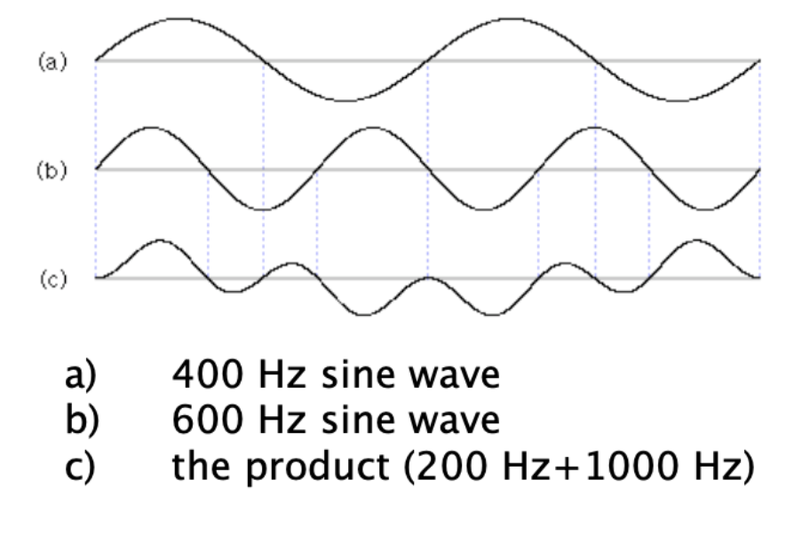

# Ring Modulation

**Ring modulation** is a form of [[modulation-synthesis|modulation synthesis]] in which two [[audio-signal|signal]]s of [[frequency|frequencies]] $f_1$ and $f_2$ are multiplied, which results in _sum_ and _difference_ tones: $f_1+f_2$ and $|f_1-f_2|$.

There are two cases:

1. If $f_1$ and $f_2$ are both [[sine-wave|sine waves]], then the output [[spectrum]] consists of two sidebands
2. Otherwise, the output spectrum consists of the sum and difference tones for each [[harmonic]] in both signals

This results in the following:

- the output spectrum is unrelated to the inputs by [[harmonic-series|harmonic relationship]]
- $f_1$ and $f_2$ do not appear in the resulting spectrum
- each [[partial]] in $f_1$ produces the sum and difference with all partials in $f_2$, which often results in dense sound

Ring modulation is the [[sound-synthesis|sound synthesis]] equivalent of the [[heterodyne-principle|Heterodyne principle]].

## Sources

- MUS 305 Lecture
- MUS 407 The Studio Age: Musique Concrète
