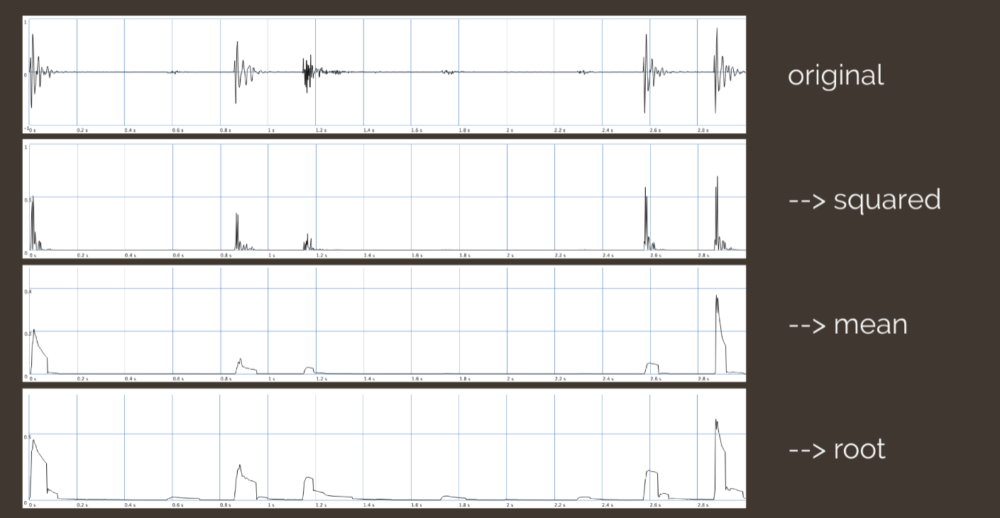
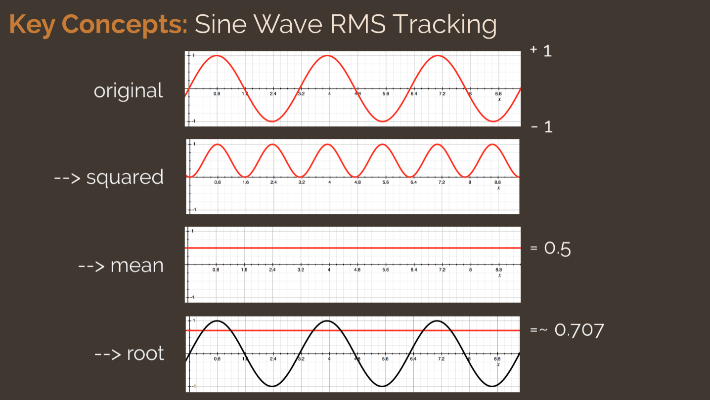

# Root mean square (RMS)

The **root mean square** (RMS) is the square _root_ of the _mean_ of a sequence of _squared_ values:

$$x_{RMS}=\sqrt{\frac{x^2_1+x^2_2+x^2_3+...+x^2_n}{n}}$$

RMS has several applications, one of which is tracking the [[amplitude]] of an [[audio-signal|audio signal]].

## Why RMS in audio?

What happens if we average sinusoidal values over a period of time?

- Positive and negative values will cancel, resulting in a zero average

RMS means we take the square _root_ of the _mean_ of a sequence of _squared_ [[sampling-signal-processing|sample]] values:

$$x_{RMS}=\sqrt{\frac{x^2_1+x^2_2+x^2_3+...+x^2_n}{n}}$$

This always produces non-negative values, provides more meaningful measurement, and more accurately reflects continuous signal power.

- results are closer to human perception than a direct average
- provides more relevant information about the power level of a signal

### RMS Tracking

General steps:

- Start with original signal
- Take the square of each value
- Over some time interval, find the average level across that interval
- Take the square root of those means (to reproduce a similar level to original signal)

### Example of RMS Tracking

