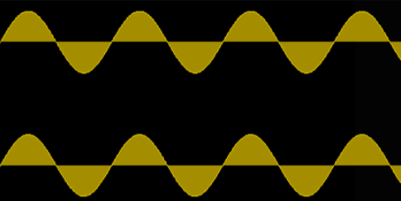

# Sine wave

A **sine wave** is the purest form of vibrational motion, also called simple harmonic motion.

The [[spectrum]] of a sine wave consists of the [[fundamental]] [[partial]] alone. All complex vibrations are comprised of sine waves at different [[amplitude]]s by the [[fourier-theorem|Fourier theorem]].

[[sine-generator|Sine generators]] are used when [[sound-synthesis|synthesizing]] sine waves [[audio-signal|audio signals]].

Sinusoids have three parameters:

- Amplitude, frequency, and phase

Mathematically, these parameters can be expressed as:

$$
s(t) = a(t) \sin(f t + )
$$

## Sources

- [MUS 407 Sound, Acoustics, & Psychoacoustics](https://prezi.com/view/ZcqvwosFJCFJQtQrbP75/)
- ["Wavetable Synthesis Algorithm Explained", Jan Wilczek (WolfSound)](https://www.thewolfsound.com/sound-synthesis/wavetable-synthesis-algorithm/)
