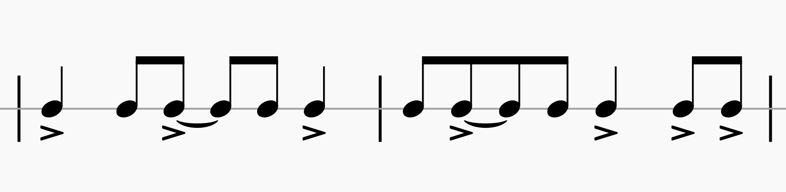

# Sinulog a Bagu

**_Sinulog a Bagu_** is a [[maguindanao|Maguindanaon]] [[palabunibunyan|kulintang ensemble]] piece/rhythmic mode.

- it is a common rhythmic mode, although it has been developed more recently

## Sources

- [Kulintang Listening Session by Harold Andre (YouTube)](https://www.youtube.com/watch?v=7b7iDVjvxPs)
