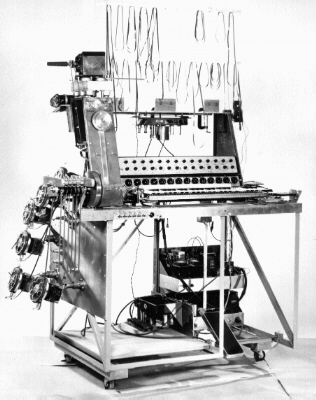

# Special Purpose Tape Recorder

The **Special Purpose Tape Recorder** is an early [[sampling-composition|sampling]] instrument invented by Hugh LeCaine in 1955.

It is capable of playing and recording onto six tape reels simultaneously. The tape speeds are controllable by a 3-octave keyboard, and the volume is controlled by six touch-sensitive buttons.

## Sources

- <http://www.hughlecaine.com/en/sptape.html>
