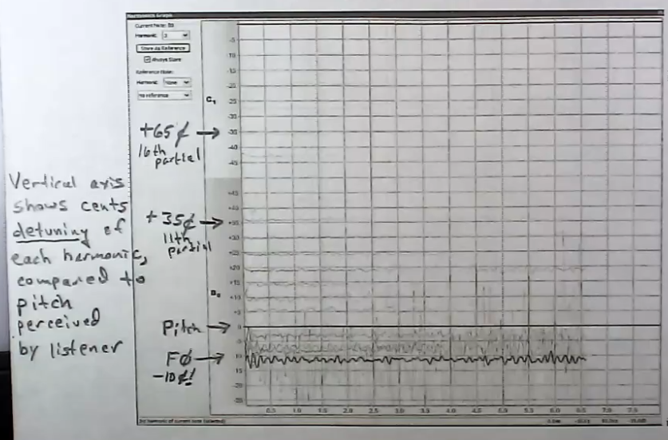

# Spectral Peak Labeling

**Spectral peak labeling** is a [[pitch-detection-algorithm|pitch detection algorithm]] that aims to combat [[inharmonicity]] in its inputs by matching each [[partial]] under a given harmonic formula. Spectral peak labeling therefore works well with sounds that don't strictly follow the [[harmonic-series|harmonic series]].

For example, spectral peak labeling can help in piano tuning, where low piano strings exhibit heavy [[string-inharmonicity|string inharmonicity]].

## Principles

Spectral peak labeling attempts to distinguish between the following:

- $F_0$: the [[fundamental]] frequency/first [[partial]]
- **Pitch detect**: the _perceived_ [[pitch]]
- **Strike note**: the pitch from a particular point in the sound onset/[[transient]], after which the sound changes to another or indeterminate pitch and the initial pitch disappears

## Steps

- Take a [[long-window-time-varying-spectral-analysis|long window]] of the [[audio-signal|signal]]
- After [[windowing]] (with something like [[kaiser-window|Kaiser]]), perform time-frequency analysis utilizing [[time-frequency-reassignment|TFR]]
- Calculate _perceived_ pitch based on measured partials
- Calculate how flat/sharp each partial is based on the perceived pitch
- Determine which formula and parameters to best represent the input spectrum
  - For string harmonicity, determine the best $B$ value to represent as many partials as best as possible

## Sources

-
