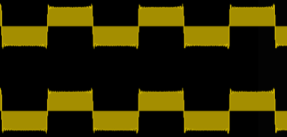

# Square Wave

A **square wave** is a periodic [[waveform]] characterized by its square-like shape and binary, discrete nature.

## Sound

A square wave is formed by summing only the odd [[partial]]s of the [[harmonic-series|harmonic series]], where each of the odd [[harmonic]]'s [[amplitude]] is inversely proportional to its [[frequency]].

- amplitude of the $n$th harmonic = $\frac{1}{n}$

The [[timbre]] of a square wave is distinctly hollow, like a clarinet or closed-end organ pipe

## Sources

- <http://www.till.com/articles/squares/>
- [MUS 407 Sound, Acoustics, & Psychoacoustics](https://prezi.com/view/ZcqvwosFJCFJQtQrbP75/)
