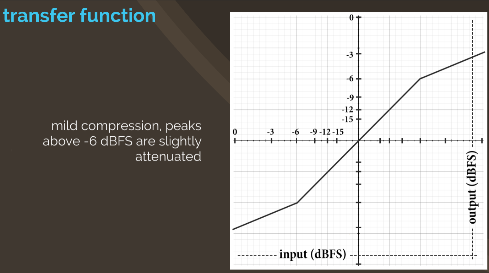
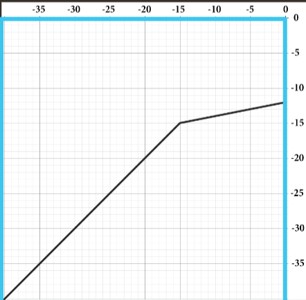
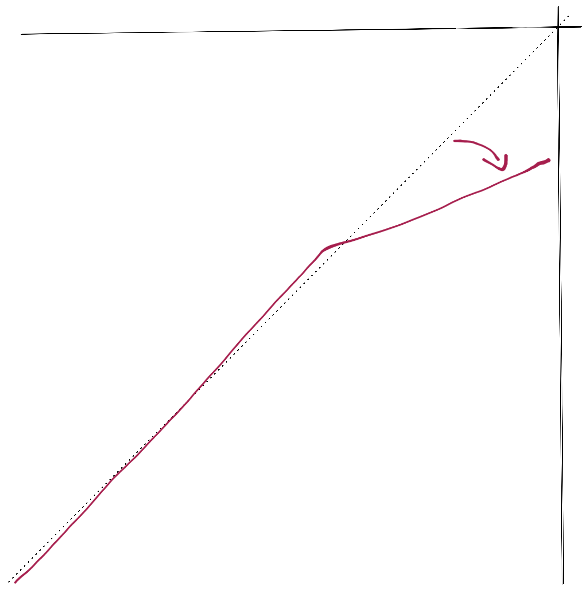
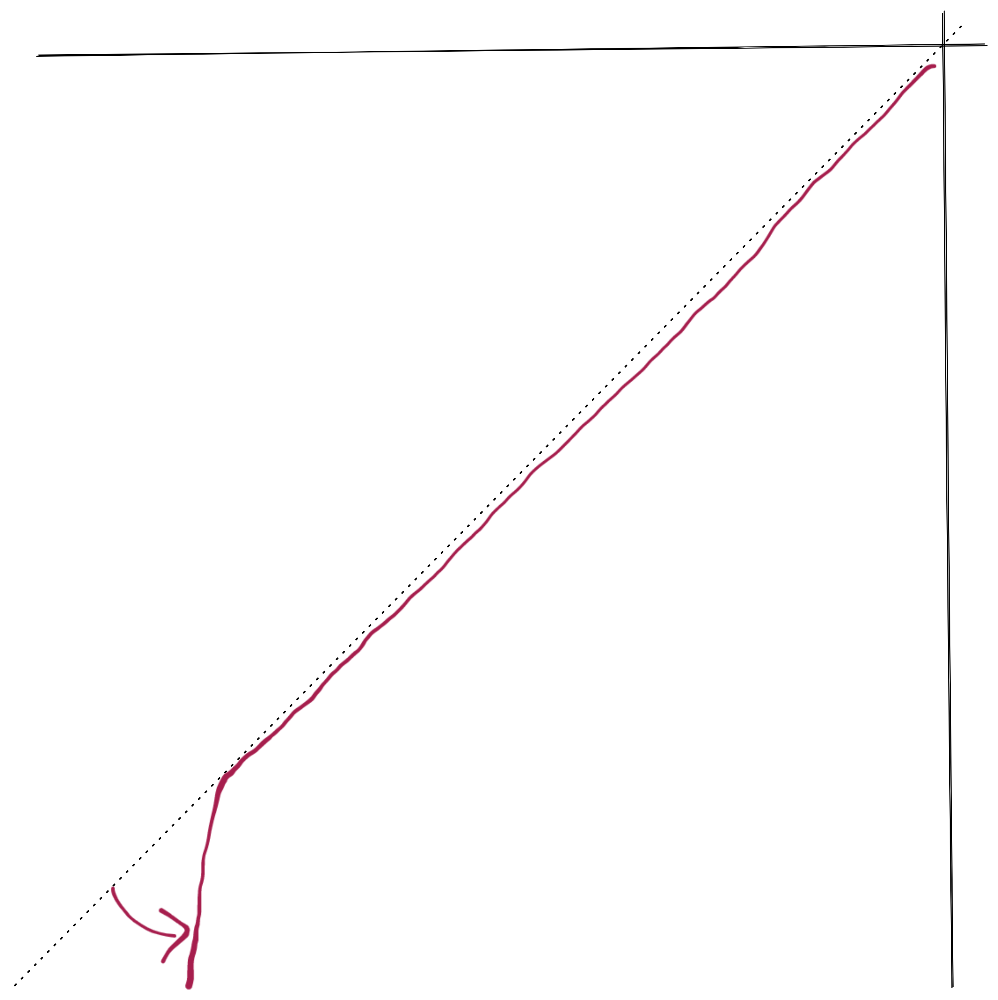
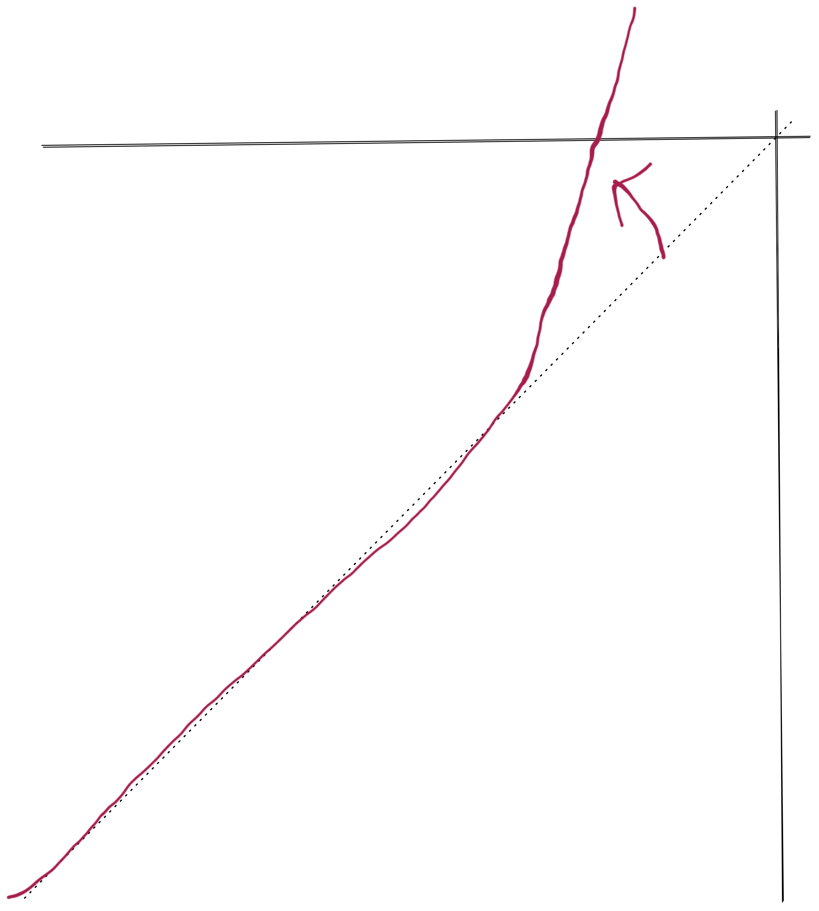

# Transfer Function

A **transfer function** has multiple meanings in [[digital-signal-processing|DSP]], detailed below.

## Digital filters

For digital [[filter|filters]], a **transfer function** is a [[fourier-transform|Fourier transform]] or [[z-transform|Z transform]] of its [[impulse-response|impulse response]].

- usually denoted with $H$

## Dynamic range processing

A **transfer function** converts a [[audio-signal|signal]] input to an output, usually applying some change. In [[dynamic-range-processing|DRP]], the signals are measured in [[decibel|dB]], and the shape of the transfer function determines the effect.

Example with downward [[compression]]:

- Standard amplifier: no compression, linear response
- Mild compression, peaks above -6 dBFS are slightly attenuated
- More severe compression, peaks above -6 dBFS are more strongly attenuated

Most DRP transfer functions only display **one quadrant** to avoid redundancy.

Typically, 0 dB input/output in upper right, axes labeled linearly with respect to dB.

### Ratio

The severity of signal processing is determined by a _ratio_.

- Represents change in input signal (dB) compared to change in output signal (dB)

Example: [[compression]] ratio of 4:1

- above threshold, if input signal increases by 4 dB, output signal is attenuated so that the increase is only 1 dB
- ratios of 8:1 and above are generally considered "extreme" compression
- can result in a perceptual [[distortion-audio|distortion]] of [[transient]]s, noticeable changes in [[timbre]], often described as a "squashed" sound

### Knee

When signal level crosses a threshold, DRP ratio may be applied fully or gradually, depending on _knee curve_

_Hard/soft_ knee refers to the smoothness of the transfer function graph across the threshold

- a hard knee has two straight lines, above and below threshold
- a soft knee curves gently between affected and unaffected [[amplitude]] regions
- differences between hard/soft knee tend to be very subtle, almost indistinguishable

### Drawing Transfer Functions

- Mark threshold (threshold is _always_ on the horizontal axis)
- Determine type of effect
  - Which effect? Which direction?
  - Which part of the graph is affected? Which part is attenuated?
  - **upward [[expander]]**: draw the transfer function at threshold, then apply makeup gain downwards
- Based on input parameters, draw graph

#### Downward Compression Shape

### Upward Compression Shape

[[upward-compression]]

### Downward Expansion Shape

### Upward Expansion Shape

## Sources

- MUS 407