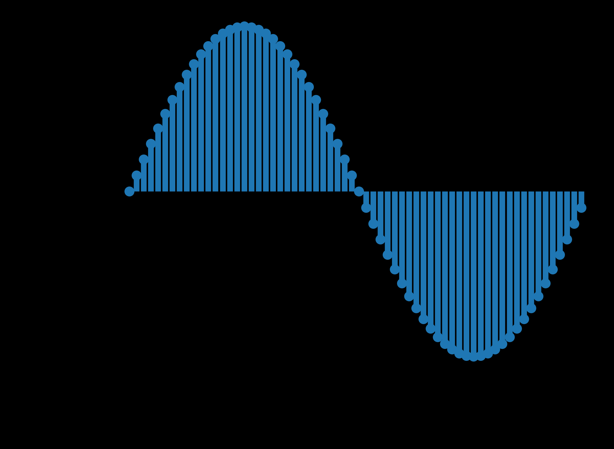

# Wave Table

A wavetable is an array in memory in which a fragment (usually a period) of a [[waveform]] is stored.

Example: a digital [[sine-wave|sine]] wave table of 64 [[sampling-signal-processing|samples]]

## Usage

Wave tables are used within [[wavetable-synthesis|wavetable synthesis]] to store pre-computed values of a waveform

- within [[digital-audio|digital audio]], wavetable synthesis results in less computation time and reduces overall [[runtime]] of most [[sound-synthesis|synthesis]] [[algorithm|algorithms]]

The process of accessing values from a wavetable is called [[wave-table-lookup|wave table lookup]].

## Sources

- ["Wavetable Synthesis Algorithm Explained", Jan Wilczek (WolfSound)](https://www.thewolfsound.com/sound-synthesis/wavetable-synthesis-algorithm/)
