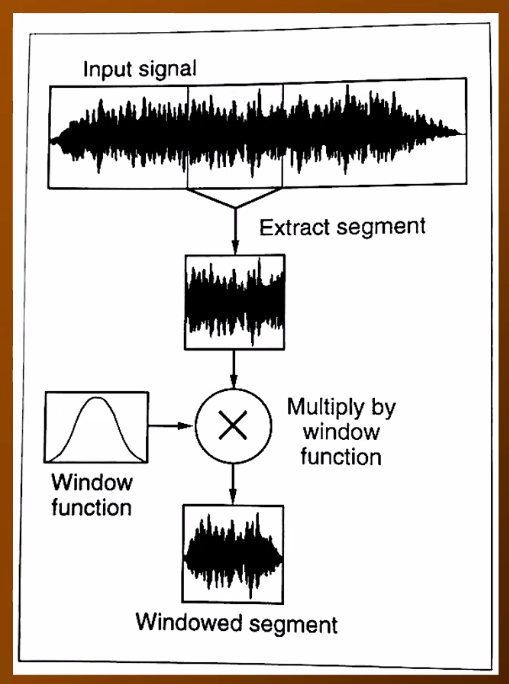

# Windowing

**Windowing** is the process of applying an [[amplitude]] [[envelope]] to a portion of a signal (in our case, an [[audio-signal|audio signal]]).

Used in [[discrete-fourier-transform|DFT]] applications to ensure smoothness and remove implicit discontinuities in a [[waveform]].

- Tapers the ends of a section of a signal to zero so they join better
- Too much windowing can alter a signal, which "blurs" the [[spectrum]]

## Sources

- MUS 409
- CS 448

